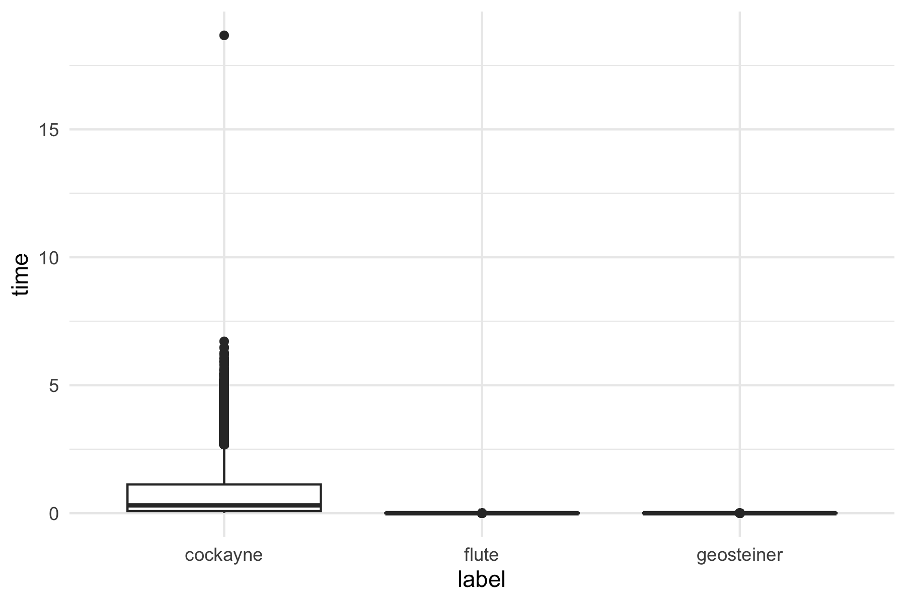

````markdown
# Simulator.sh

A Bash-based simulation framework for generating and testing Steiner Tree algorithms using:

- **Flute** (`flute-3.1`) - a state of the art heuristic program for generating RSMT
- **GeoSteiner** (`geosteiner-5.3`) - an exact algorithm for generating RSMT
- **Cockayne (RSMT implementation)** (`\code\Cockayne Ishan.cpp`) - a dp-based exponential-time-complexity algorithm-modification of Dreyfus, Wagner's algorithm.

---

## Usage

```bash
./Simulator.sh [options] <lower limit of #terminals> <upper limit of #terminals>
````

### Options

| Flag | Argument         | Description                                                                     |
| ---- | ---------------- | ------------------------------------------------------------------------------- |
| `-h` | none             | Show help message                                                               |
| `-s` | `<seed>`         | Seed for the random number generator                                            |
| `-n` | `<iterations>`   | Number of test cases to generate/run                                            |
| `-a` | `<algo>`         | Algorithm(s) to run. Can include: `f` (Flute), `g` (GeoSteiner), `c` (Cockayne) |
| `-i` | `<input_folder>` | Path to input/output folder (default: current directory)                        |

---

## Examples

### Show help

```bash
./Simulator.sh -h
```

### Generate 10 test cases, terminals between 5 and 50

```bash
./Simulator.sh -n 10 5 50
```

### Run only Flute on 20 cases, terminals between 10–100

```bash
./Simulator.sh -a f -n 20 10 100
```

### Run all algorithms on an existing input file

```bash
./Simulator.sh -a fgc -i ./inputs -n 5 5 20
```

---

## Output Files

* **Inputs**: `in_<iterations>_<lower>-<upper>.txt`
* **Algorithm outputs**:

  * `flute_out_<iterations>_<lower>-<upper>.txt`
  * `geosteiner_out_<iterations>_<lower>-<upper>.txt`
  * `cockayne_out_<iterations>_<lower>-<upper>.txt`
* **Logs**:

  * `flute_logs_<iterations>_<lower>-<upper>.txt`
  * `geosteiner_logs_<iterations>_<lower>-<upper>.txt`
  * `cockayne_logs_<iterations>_<lower>-<upper>.txt`

---

## Requirements

* **Bash** (5+ recommended)
* **g++** (to compile Cockayne implementation)
* **make** (to build Flute and GeoSteiner)

Dependencies:

* `flute-3.1/` → must contain `rand-pts` and `flute-demo`
* `geosteiner-5.3/` → must contain `my_demo`
* `Steiner Tree/Code/RSMT.cpp`

---

## Notes

* You must provide `<lower>` and `<upper>` terminal limits
* At least one algorithm must be specified using `-a`
* Existing input files are truncated and regenerated automatically
* Runtime errors are logged to corresponding `*_logs_*.txt` files

---

## 📊 Data Analysis

After generating and collecting results from the three algorithms (Cockayne, Geosteiner, Flute), we perform exploratory data analysis and regression modeling in **R**.

### 1. Loading the Data
The combined results are stored in `datasets/summary.csv`. Each row corresponds to a test case and includes:
- `num_points`: number of terminals
- `grid_size`: maximum span of x/y coordinates
- `*_steiner`: number of Steiner points detected by each algorithm
- `*_wirelength`: total wirelength for each algorithm
- `*_time`: CPU runtime for each algorithm

```r
df <- read.csv("datasets/summary.csv")
head(df)
````

### 2. Runtime Comparison

We reshape the runtime columns into a long format and compare distributions with **boxplots**:

```r
library(ggplot2)

df2 <- data.frame(
  time = c(df$cockayne_time, df$flute_time, df$geosteiner_time),
  label = as.factor(c(
    rep("cockayne", nrow(df)),
    rep("flute", nrow(df)),
    rep("geosteiner", nrow(df))
  ))
)

p1 <- ggplot(df2, aes(x = label, y = time)) +
  geom_boxplot() +
  theme_minimal()

ggsave("plots/myplot.png", plot = p1, width = 6, height = 4, dpi = 300)
```

📷 Example output (saved as `plots/myplot.png`):



### 3. Regression Models

We fit linear regression models to identify which factors (number of points, grid size, Steiner points, wirelength) explain algorithm runtimes:

```r
# Cockayne
m_cockayne <- lm(cockayne_time ~ as.factor(num_points) + grid_size + cockayne_steiner + cockayne_wirelength, data = df)
summary(m_cockayne)

# Geosteiner
m_geo <- lm(geosteiner_time ~ as.factor(num_points) + grid_size + geosteiner_steiner + geosteiner_wirelength, data = df)
summary(m_geo)

# Flute
m_flute <- lm(flute_time ~ as.factor(num_points) + grid_size + flute_steiner + flute_wirelength, data = df)
summary(m_flute)
```

These models help quantify the effect of grid size and Steiner points on runtime.

### 4. Diagnostic Plots

Residual diagnostics for all models are saved together for model validation:

```r
jpeg("plots/all_diagnostics.jpg", width = 1800, height = 1200, res = 150)
par(mfrow = c(3, 4))
plot(m_cockayne, which = 1:4, main = "Cockayne")
plot(m_geo, which = 1:4, main = "Geosteiner")
plot(m_flute, which = 1:4, main = "Flute")
dev.off()
```

📷 The resulting file `plots/all_diagnostics.jpg` contains **12 diagnostic plots** (4 for each algorithm).

---

### Summary

* **Boxplots** show the distribution of runtimes across algorithms.
* **Regression models** identify key predictors of runtime.
* **Diagnostics** check assumptions of linear regression.

This analysis pipeline provides both descriptive and inferential insights into algorithm performance.

---

